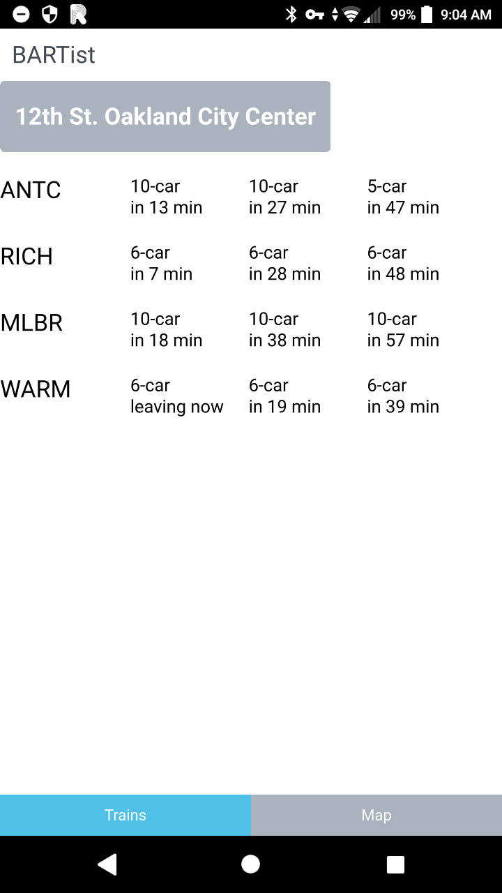
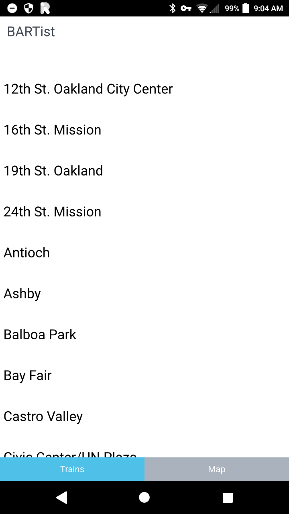
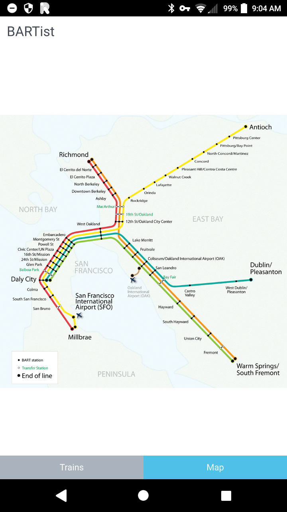

After [Ubuntu Touch was discontinued](../history-ubuntu-touch/) I moved back to Android. I wanted a compact AOSP phone, but most phones were getting larger with time. I ended up getting Sony Xperia X Compact.

After novelty wore off, I promptly de-Googled it, but now I had the same problem - I needed a simple BART live train departures app. So I dusted off my Ubuntu Touch project and ... who wants to write Java, right? Just use cross platform Qt with QML on Android!

This ended up a bigger project than I had intended. I ported BARTist to Qt/QML on Android and [wrote a blog post about it](https://unix1.net/qt-qml-android-app-development-setup/).

This is how it looked

This was the station selector

And I added the BART map

Not pictured in the linked blog post is time I spent getting OpenSSL to compile with Qt in order to ship the app package to Google Play. It worked in the end though and BARTist grew into its second app store home.

What happened to it? Eventually Google got me on minor OpenSSL version bug fix release and I never bothered upgrading and resubmitting. They removed my app after a grace period.
