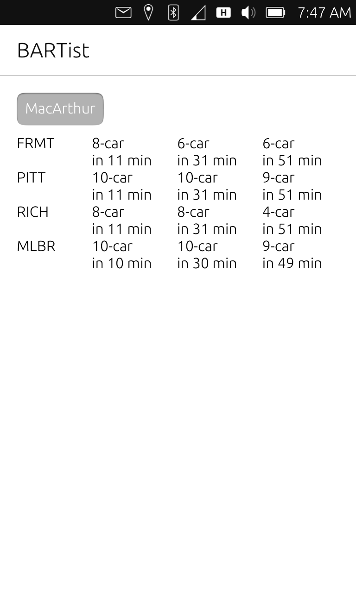
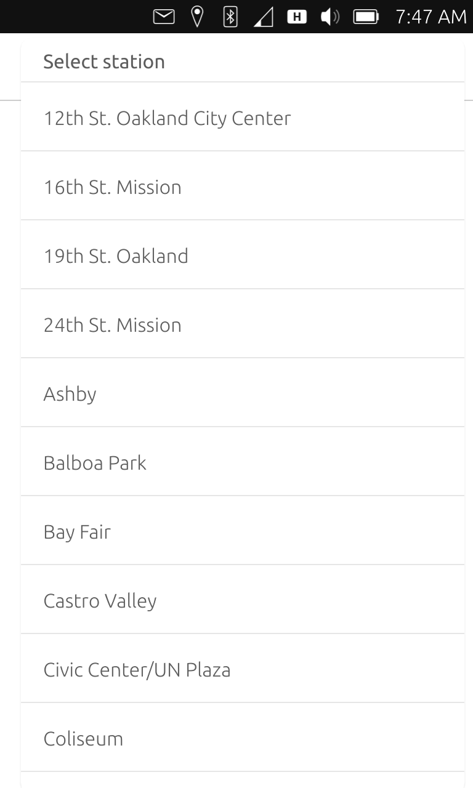

Here's a fun fact: I started BARTist as an [Ubuntu Touch](https://en.wikipedia.org/wiki/Ubuntu_Touch) app circa 2016. I was into mobile phones outside of the duopoly and was giving the Ubuntu Touch a go as my main daily phone on a no longer used Nexus 4.

This was working out great for very basic functionality. However, for certain uses, apps are convenient, and there wasn't a wide variety. My daily commute included BART, so out of convenience, I wrote an app to track train departure times. Here's a screenshot

For those who don't know, BART has a very liberal, [developer friendly API](https://www.bart.gov/schedules/developers/api). Here's how you'd pick a station

I even figured out how to implement pull-to-refresh in QML! I published the app on the official Ubuntu repository, but alas, the platform was shut down the following year.

Here's my attempt to style the download button for it

If anyone is curious, the old code is on the [`1.x-ubuntu`](https://github.com/unix1/bartist/tree/1.x-ubuntu) branch of the bartist repo.
